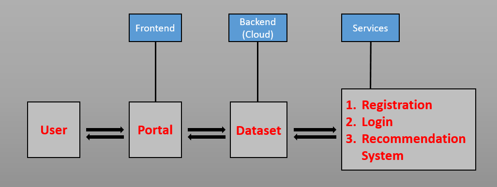

# Slakathon-Project-Weather-Prediction-&-Analysis
## Contents 

- [Project Name](#Slakathon-Project-Weather-Prediction-&-Analysis)
- [Contents](#Contents)
- [Short description](#Short-description)
	- [Problem Identification](#Problem-Identification)
	- [How can technology help?](#How-can-technology-help)
	- [The idea](#The-idea)
- [The architecture](#The-architecture)
- [Project roadmap](#Project-roadmap)
## Short description
### Problem Identification
In todays era uneven weather conditions had messed up the arrangements made by the local organisations and the national policies. These unpredictable weather conditions  not only harm the lives of people but also hampers a country's path to development. Predicting weather condition with the help of various criteria such as humidity,pressure & temprature can help more in todays world.
### How can technology help
These predicted weather conditions can help government and local authorities to take necessary actions. A portal can be developed online to help farmers and other users to see weather condition and to sow & harvest crops accordingly.
### The idea
Using historical data of weather to train a machine learning model, we can predict weather conditions for certain period of time more accurately in the future and at same time this data will be used for the bettter growth of the agriculture sector to plan various ameneties.
## The architecture

## Project roadmap
- The model can be deployed on the portal at the backend along with the dataset for the predictions.
